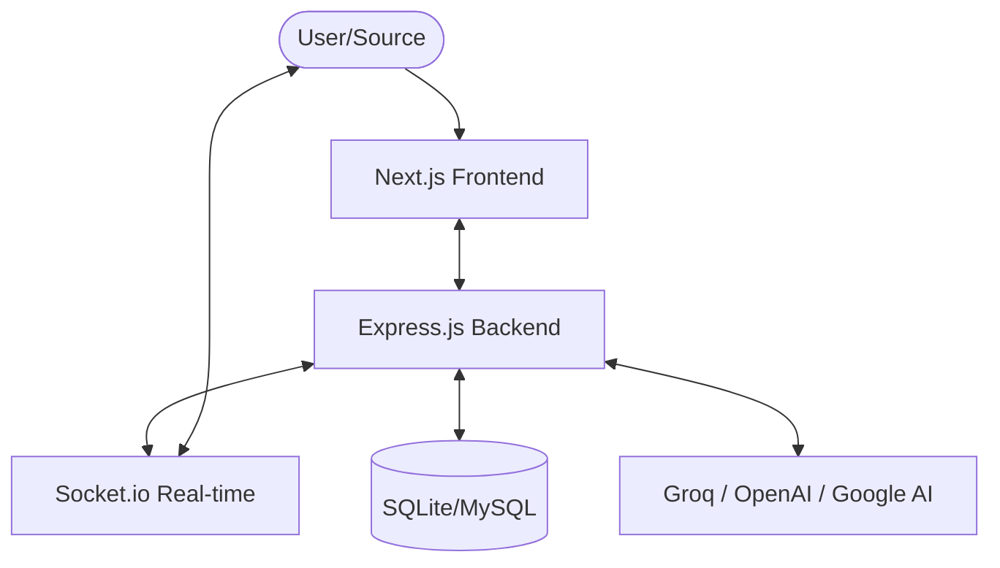

<h1 align="center">
  <a href="https://github.com/CommunityOfCoders/Inheritance2k25">
    CoC Inheritance 2025
  </a>
  <br>
  MindLink+: Your Personal Peer Support & Wellbeing Platform
</h1>

<div align="center">
By smitbhoir20
</div>
<hr>

<details>
<summary>Table of Contents</summary>

- [Description](#description)
- [Links](#links)
- [Tech Stack](#tech-stack)
- [Progress](#progress)
- [Future Scope](#future-scope)
- [Applications](#applications)
- [Project Setup](#project-setup)
- [Team Members](#team-members)
- [Mentors](#mentors)

</details>

## Description

MindLink+ is a modern, student-friendly mental wellbeing platform designed to provide a safe space for anonymous peer support. The platform addresses the critical need for accessible mental health resources, offering themed chat rooms, an AI-powered wellness companion (MoodBot), and daily self-care challenges. Built with a focus on privacy and community, it helps students navigate stress, anxiety, and loneliness together.

## Links

- [GitHub Repository](https://github.com/smitbhoir20/Mind-Link)
- [Demo Video](https://drive.google.com/drive/folders/1ZF4nDWSZp99R-2eETPNnloso3zFWdA_8)
- [Project Screenshots](https://drive.google.com/drive/folders/1ZF4nDWSZp99R-2eETPNnloso3zFWdA_8)
- [Hosted Website](https://mind-link-steel.vercel.app/)

## Tech-Stack

### System Architecture



### Front-end
- **Next.js**: Modern React framework for the interface.
- **Tailwind CSS**: Utility-first CSS for responsive design.
- **Lucide React**: Clean and consistent iconography.
- **Socket.io-client**: Real-time communication for chat rooms.

### AI & Backend
- **Framework**: Express.js
- **Database**: SQLite (local development) / MySQL (production)
- **AI Integration**: Groq SDK for lightning-fast AI responses
- **Communication**: Socket.io for real-time anonymous chat

## Screenshots

| | |
|:---:|:---:|
|  <br> *Landing Page* |  <br> *Support Categories* |
|  <br> *Get Started Section* |  <br> *Buddy Chat (P2P)* |
|  <br> *Anonymous Chat Rooms* |  <br> *AI MoodBot* |
|  <br> *Daily Self-Care* |  <br> *About MindLink+* |

---

## Progress

### Fully Implemented Features

* **Anonymous Peer Chat Rooms**: Real-time themed rooms (Exam Stress, Career Talk, Focus Zone) with identity protection.
* **AI MoodBot**: 24/7 AI wellness companion for instant support and coping strategies.
* **Daily Self-Care Challenges**: Interactive wellness habits and daily challenges.
* **Safe Space Moderation**: Environment designed for empathy and anonymity.

---

### Partially Implemented Features / Work in Progress

* **Enhanced AI Personality**: Further refining MoodBot for more nuanced emotional responses.
* **Expanded Room Categories**: Adding more niche support groups based on student feedback.

## Future Scope

* **Specialized AI Modules**: Integration of specific CBT-based AI therapy paths.
* **Mobile Application**: Porting the platform to React Native for cross-platform accessibility.
* **Voice Support**: Adding voice-to-text and voice chat capabilities for better accessibility.

## Applications

1. **Academic Institutions** - Providing students with an immediate, low-barrier support network.
2. **Student Counseling Services** - Acting as a supplementary tool for mental health professionals to reach more students.

## Project Setup

### 1. Clone the GitHub repo

```bash
git clone https://github.com/smitbhoir20/Mind-Link.git
```

### 2. Install Dependencies

**Frontend:**
```bash
cd frontend
npm install
```

**Backend:**
```bash
cd ../backend
npm install
```

### 3. Environment Configuration

Create a `.env` file in the `backend` directory based on `.env.example`:
```env
PORT=5000
OPENAI_API_KEY=your_key_here
GROQ_API_KEY=your_key_here
DB_HOST=localhost
DB_USER=root
DB_PASSWORD=your_password
DB_NAME=mindlink
```

### 4. Start the Application

**Run Backend:**
```bash
cd backend
npm start
```

**Run Frontend:**
```bash
cd frontend
npm run dev
```

## Team Members

* **Smit Bhoir**: [https://github.com/smitbhoir20](https://github.com/smitbhoir20)
* **Nihal Nayak**: [https://github.com/nihalnayak45](https://github.com/nihalnayak45)
* **Abhinav Patil**: [https://github.com/pluss3446](https://github.com/pluss3446)
* **Debojyoti Ghoshal**: [https://github.com/debojyotighoshal](https://github.com/debojyotighoshal)


## Mentors

* **[Mentor Name]**: [https://github.com/smitbhoir20](https://github.com/smitbhoir20)
